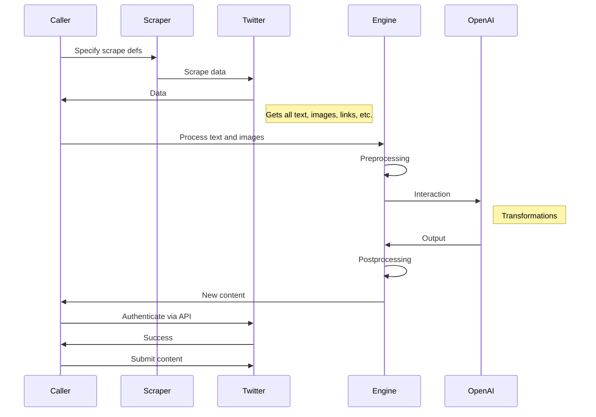

# gpt-wrappers 

## Setup
 - Install python3
 - Run: `pip install -r requirements.txt`

## Openai API setup instructions

1. create an api key from: https://platform.openai.com/account/api-keys
2. save the api key in a file call key.txt

## Quickstart

#### Engine Example:



```python
# example code: run the Plan demo flow above.
import engine

queries = ['Incredible Hulk', 'Nicolas Cage']
tweets = engine.run(queries, n=40)
```

### GPT Examples

#### Quickstart GPT Tricks

```python
import tricks

content = """
Buzz Aldrin left a pen on the moon after the first visit. 
Eugene Cernan, the last moon walker, found it. It still worked.
"""

# chaining opposite+summarized+analogy
flipped = tricks.opposite(content)
summarized = tricks.summarize(flipped)
analogy = tricks.analogy(summarized)
```

#### DALL-E Examples

Generate variation images from an image online
```python
import engine
url = "https://s3.amazonaws.com/CFSV2/obituaries/photos/9995/995933/5fc571372bb52.JPG"
file_id = "milo"

# save the images and return
seed, images = engine.variations(url, file_id, n=10)

# view the images on desktop
seed.show()
for img in images:
    img.show()
```

### Twitter Examples
Anonymously scrape twitter with critera and storing all the text and images

#### Scrape with queries
```python
import twit_scraper as ts

queries = ['overwatch', 'toxic gamers', 'barbie']
for query in queries:
    output_dir = f'./tmp/{query.replace(" ", "_")}'
    scraper = ts.scrape_search(query)
    ts.run_scraper(scraper, output_dir)
```


#### Scrape a user's tweets
```python
import twit_scraper as ts

user = "ChomskyDotInfo"
output_dir = f'./tmp/{user}'
scraper = ts.scrape_user(user)
ts.run_scraper(scraper, output_dir)
```
